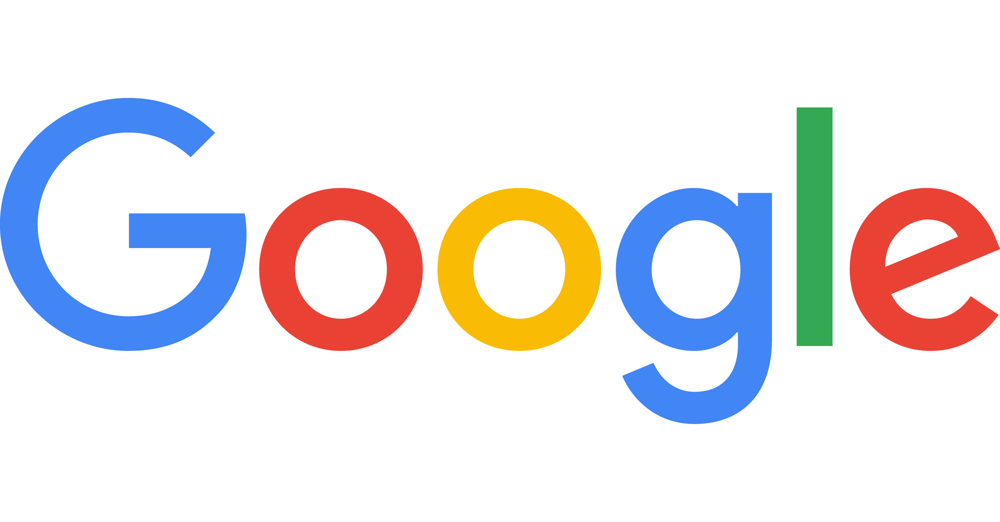

<p align="center">
  <a href="https://github.com/privacy-tech-lab/privacy-pioneer/releases"></a>
  <a href="https://github.com/privacy-tech-lab/privacy-pioneer/releases"></a>
  <a href="https://github.com/privacy-tech-lab/privacy-pioneer/commits/main"></a>
  <a href="https://github.com/privacy-tech-lab/privacy-pioneer/actions/workflows/node.js.yml"></a>
  <a href="https://github.com/privacy-tech-lab/privacy-pioneer/issues"></a>
  <a href="https://github.com/privacy-tech-lab/privacy-pioneer/issues?q=is%3Aissue+is%3Aclosed"></a>
  <a href="https://github.com/privacy-tech-lab/privacy-pioneer/watchers"></a>
  <a href="https://github.com/privacy-tech-lab/privacy-pioneer/stargazers"></a>
  <a href="https://github.com/privacy-tech-lab/privacy-pioneer/network/members"></a>
  <a href="https://github.com/sponsors/privacy-tech-lab"></a>
</p>

<p align="center">

</p>

# Privacy Pioneer

The idea of Privacy Pioneer is to help people understand the data collection and sharing practices of the websites they visit. For instance, the following URL-encoded string contains the latitude and longitude where a person is located:

> https%3A%2F%2Fwww.example.com%2Flocation%3Flat%3D32.715736%26lon%3D%20-117.161087

If such a string is sent to a site via an HTTP POST request, it can be concluded that it is collecting or sharing location data. Privacy Pioneer automatically detects such behaviors and displays them in privacy labels.

Privacy Pioneer's privacy practice analysis is based on rule-based heuristics as well as a machine learning model. When you install Privacy Pioneer, the model is served from our [machine learning repo](https://github.com/privacy-tech-lab/privacy-pioneer-machine-learning).

Privacy Pioneer is implemented as a browser extension for Firefox (currently the only browser we support).

<p align="center">
  <a href="https://addons.mozilla.org/en-US/firefox/addon/privacy-pioneer/"></a>
<p/>

Privacy Pioneer is developed and maintained by **Daniel Goldelman (@danielgoldelman)**, **Judeley Jean-Charles (@jjeancharles)**, **Joe Champeau (@JoeChampeau)**, and **Sebastian Zimmeck (@SebastianZimmeck)** of the [privacy-tech-lab](https://privacytechlab.org/). **Hamza Harkous (@harkous)** is also collaborating with the team on the research. **Wesley Tan (@wesley-tan)**, **Justin Casler (@JustinCasler)**, **Logan Brown (@Lr-Brown)**, **Owen Kaplan (@notowen333)**, **Rafael Goldstein (@rgoldstein01)**, and **David Baraka (@davebaraka)** contributed earlier.

Contact us with any questions or comments at <sebastian@privacytechlab.org>.

[1. Research Publications](#1-research-publications)  
[2. Promo Video](#2-promo-video)  
[3. Development](#3-development)  
[4. Production](#4-production)  
[5. Testing](#5-testing)  
[6. Source Directory Layout](#6-source-directory-layout)  
[7. Privacy Practice Analysis](#7-privacy-practice-analysis)  
[8. Notifications](#8-notifications)  
[9. Extension Architecture](#9-extension-architecture)  
[10. Third Party Libraries and Resources](#10-third-party-libraries-and-resources)  
[11. Known Issues](#11-known-issues)  
[12. Thank You!](#12-thank-you)

## 1. Research Publications

- Sebastian Zimmeck, Daniel Goldelman, Owen Kaplan, Logan Brown, Justin Casler, Judeley Jean-Charles, Joe Champeau and Hamza Harkous, [Website Data Transparency in the Browser](https://sebastianzimmeck.de/zimmeckEtAlPrivacyPioneer2024.pdf), 24th Privacy Enhancing Technologies Symposium (PETS), Bristol, UK and Online Event, July 2024, [BibTeX](https://sebastianzimmeck.de/citations.html#zimmeckEtAlPrivacyPioneer2024Bibtex). If you are using code or interfaces from Privacy Pioneer, please cite this paper.
- Judeley Jean-Charles, Daniel Goldelman, Justin Casler, Logan Brown, Owen Kaplan, Hamza Harkous, Sebastian Zimmeck, [Privacy Pioneer: Automating the Creation of Privacy Labels for Websites](https://github.com/privacy-tech-lab/privacy-pioneer/blob/main/research/jean-charlesEtAlPrivacyPioneer2023Slides.pdf), Summer Research 2023 Presentation, Wesleyan University, July 2023
- Daniel Goldelman, Logan Brown, Justin Casler, Judeley Jean-Charles, Sebastian Zimmeck, [Privacy Pioneer: Automating the Creation of Privacy Labels for Websites](https://youtu.be/emENqmVxi7k), Talk @ Google, Online, October 2022
- Owen Kaplan, [Privacy Pioneer: Creating an Automated Data-Privacy UI for Web Browsers](https://digitalcollections.wesleyan.edu/object/ir%3A3180), Undergraduate Honors Thesis, Wesleyan University, April 2022
- Owen Kaplan, Logan Brown, Daniel Goldelman, Sebastian Zimmeck [Creating Privacy Labels for the Web](http://summer21.research.wesleyan.edu/2021/07/27/creating-privacy-labels-for-the-web/), Summer Research 2021 Poster Session, Wesleyan University, Online, July 2021

## 2. Promo Video

Unmute or turn up the volume if you do not hear any sound.

<https://github.com/privacy-tech-lab/privacy-pioneer/assets/78764811/45fb8cae-0cd3-426b-921c-3b48ce7daf4a>

## 3. Development

Ensure that you have node and npm installed.

You can install the latest version of node from the [official site](https://nodejs.org/en/download/current).

You can install the latest version of npm with:

```bash
npm install -g npm
```

Clone this repo to a local directory and [install Privacy Pioneer's dependencies](https://github.com/privacy-tech-lab/privacy-pioneer/issues/249#issuecomment-885723394) by running in the root of your directory:

```bash
npm install --production=false
```

**Note**: Privacy Pioneer uses an external service, [ipinfo.io](https://ipinfo.io/), to automate the identification of a user's Location in web traffic of visited websites. For this purpose Privacy Pioneer sends a user's IP address to ipinfo.io when the user restarts the browser or makes changes to the Watchlist. An ipinfo API token is required for Privacy Pioneer to work.

In order to get your ipinfo API token, you must sign up for a free account with ipinfo via https://ipinfo.io. Then once you're signed in, you must go to the token tab and copy the token that is displayed to clipboard. Once this is done you must then:

Create a file `holdAPI.js` and save it in the `/src/libs/` folder with your ipinfo API token as follows:

```javascript
export const apiIPToken = "<your ipinfo API token>";
```

Be sure to not add your ipinfo API token to GitHub to avoid misuse.

To start Privacy Pioneer, run:

```bash
npm start
```

- Runs Privacy Pioneer in development mode
- The popup, options, and background page will reload if you make edits
- You will also see any lint errors in the console

A `dev` folder will be generated in the root directory, housing the generated extension files. Firefox should automatically open with the extension installed. If not, you can follow the instructions [here](https://github.com/privacy-tech-lab/privacy-pioneer/issues/12#issuecomment-776985944), where `dev` will be the new `src` folder.

**Note:** If you experience errors regarding missing dependencies (usually due to a newly incorporated node package), delete the `node_modules` folder and then re-run the installation steps above. You may also want to delete `package-lock.json` along with the `node_modules` folder as a second attempt to solve this issue. If needed, you can create a new package-lock.json file with:

```bash
npm install --package-lock-only
```

## 4. Production

Build Privacy Pioneer for production to the `dist` folder by running:

```bash
npm run build
```

- The build is minified and the filenames include hashes
- It correctly bundles and optimizes the extension for the best performance

The `web-ext` cli is included in the project. Learn more about packaging and signing for release at the [extension workshop](https://extensionworkshop.com/documentation/develop/getting-started-with-web-ext/).

## 5. Testing

Privacy Pioneer uses [Jest](https://jestjs.io/) to run unit tests in order to maintain the integrity of the extension. All test files live in ./src/tests. In order to create a new test either add it to an existing test file or add it to a new file that ends with `.test.js`

All tests will be run on GitHub upon creating a pull request.

To run all tests locally:

```bash
npm run test
```

## 6. Source Directory Layout

```bash
.
├── src                 # Extension source code
|   |── assets          # Images and other public files used in the extension
|   |── background      # Code for extension background related tasks (Ex. HTTP analysis)
|   |── libs            # Reusable utility functions and components used in frontend
|   |── options         # Options page frontend SPA
|   |── popup           # Popup dialog view frontend SPA
|   |── tests           # Testing capabilities
|   └── manifest.json   # Extension metadata
└── ...
```

The options and popup directories are similarly structured. Like many react projects they have an `index.html` file and `index.js` file which serve as the entry points. These directories also have a `components` directory, which contains reusable components to be used within it's parent directory, and a `views` directory, which contains page views (which are just more react components). Each component has an `index.js` file as an entry point to that component, and they may also contain a `style.js` file for scoped styling. For styling, we use a popular technique called CSS in JS to apply styles using the third party library [styled components](https://styled-components.com). Styled components are prefixed with a `S`, e.g. `SContainer`. For more complex components or views, there may be an additional `components` directory. For transitions and animations, we use the third party library [framer motion](https://www.framer.com/motion/).

The `src/libs/indexed-db` directory, contains functions that instantiate and communicate with the IndexedDB in the Firefox browser.

Some logos and other assets are in a Figma [here](https://www.figma.com/team_invite/redeem/rVKfai7IOrG1D90QriS5DJ).

## 7. Privacy Practice Analysis

Privacy Pioneer is analyzing the following privacy practices for each first and third party website.

- Monetization
  - Advertising (from Disconnect)
  - Analytics (from Disconnect)
  - Social Networking (Social from Disconnect)
- Location
  - GPS Location
  - ZIP Code
  - Street Address
  - City
  - Region
- Tracking
  - Tracking Pixel
  - IP Address
  - Browser Fingerprinting (FingerprintingInvasive from Disconnect, our own list)
- Personal
  - Phone Number
  - Email Address
  - Custom Keywords

Privacy Pioneer utilizes the [Geolocation API](https://developer.mozilla.org/en-US/docs/Web/API/Geolocation_API), which is built into most modern browsers, to obtain the user's Latitude and Longitude. This information will not be shared with the developers or any third parties. It is used to check if the user's Latitude and Longitude show up in any of the network data being taken by first parties or shared with third parties by the current website.

Privacy Pioneer makes a distinction between Fine Location and Coarse Location within the GPS Location privacy practice listed above. Fine location means that the number calculated by the individual website is within +-0.1 degrees from the Geolocation API value, and Coarse Location means that it is within +-1.0 degrees. Thus, an instance of a user's latitude or longitude being taken or shared can result in one of the following outcomes in the extension:

- The evidence is not flagged due to obfuscation or some other way of protecting against the type of analysis employed by Privacy Pioneer.
- The evidence is flagged by Privacy Pioneer as being an instance of Coarse Location and not Fine Location. This would mean that the latitude or longitude value is within +-1.0 degrees of the value determined by the Geolocation API.
  The evidence is flagged by Privacy Pioneer as being an instance of both Coarse Location AND Fine Location. This would mean that the latitude or longitude value is within +-0.1 (and thus also +-1.0) degrees of the value determined by the Geolocation API.

ipinfo.io is sent the user's IP address and returns information about their location based on that IP address. We take the user's Zip Code, Street Address, City, and Region from this and store it as an entry in the user's Watchlist to be looked for in new HTTP requests.

## 8. Notifications

If a user looks up a specific keyword from their watchlist (for example in a search bar or search engine), we will show notifications of this keyword being taken by a first party. For normal lookups (like keywords a user could be interested in), this will appear as strange, but it is important to know when a website is or is not encrypting user data when sending it to their backend APIs, since all web traffic has the potential to be monitored in transit across the internet.

Privacy Pioneer will notify a user when any of their watchlist information has been seen in their network traffic if the user has enabled notifications on the browser and in the watchlist page of the extension. These notifications will occur 15 seconds after a site has loaded to let the page load most of its data. User's Custom Keywords (shown as "Keyword" in the extension) will generate a notification each time they appear in the user's web traffic, while all other keywords being seen will generate a notification once per session per website that collected or shared a user's information. Note that if multiple notifications would have qualified for all categories other than personal (eg. zip, region, and IP would have been notified), only one notification will be shown, with a "..." following the first to signify that this is a joint notification and the user should check the extension to see Privacy Pioneer's findings.

## 9. Extension Architecture

An overview of the architecture of Privacy Pioneer is [available separately](https://github.com/privacy-tech-lab/privacy-pioneer/blob/main/architecture_overview.md). (The document is up to date as of its most recent commit date. Later architectural changes are not reflected.)

## 10. Third Party Libraries and Resources

Privacy Pioneer uses various [third party libraries](https://github.com/privacy-tech-lab/privacy-pioneer/blob/main/package.json).

It also uses the following resources.

- [Disconnect Tracker Protection lists](https://github.com/disconnectme/disconnect-tracking-protection)
- [Eva Icons](https://akveo.github.io/eva-icons/#/)
- [iconmonstr](https://iconmonstr.com/)
- [Ion Icons](https://ionicons.com)
- [Radar Icon](https://www.svgrepo.com/svg/167040/radar)
- [Simple Icons](https://github.com/simple-icons/simple-icons)

We thank the developers.

## 11. Known Issues

- Some warnings may occur when you run `npm install --production=false`, but they will not negatively affect the compilation or execution of Privacy Pioneer.
- When the overview page of Privacy Pioneer is open, data from websites visited after opening it will not be shown until the overview is refreshed.
- We do not look at the main HTML / main_frame type of data request in this extension. Thus, data that was loaded into the main body of the webpage, and not through an external query, will not generate evidence in Privacy Pioneer.

## 12. Thank You

<p align="center"><strong>We would like to thank our financial supporters!</strong></p><br>

<p align="center">Major financial support provided by Google.</p>

<p align="center">
  <a href="https://research.google/outreach/research-scholar-program/recipients/?category=2022/">
    
  </a>
</p>

<p align="center">Additional financial support provided by Wesleyan University and the Anil Fernando Endowment.</p>

<p align="center">
  <a href="https://www.wesleyan.edu/mathcs/cs/index.html">
    
  </a>
</p>

<p align="center">Conclusions reached or positions taken are our own and not necessarily those of our financial supporters, its trustees, officers, or staff.</p>

##

<p align="center">
  <a href="https://privacytechlab.org/"></a>
<p>
